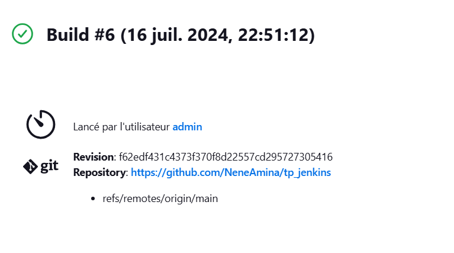

# Nene Aminatou Diallo
# Rimey Aboky

# Docker jenkins
## 1. Architecture mise en place repertoire github

## 1.1 Mise en place du repertoire de travail
Nous allons migrer le repertoire de test vers un repertoire dont nous avons le contraire.
nous clone le repertoire de test
```bash
git clone https://github.com/karimsahebettabaa/jenkins-docker
```
Ensuite nous pointons l'url du repo de test vers le nouveau repo que nous avons créé [repertoire de travail](https://github.com/NeneAmina/tp_jenkins).
```bash
git remote set-url origin https://github.com/NeneAmina/tp_jenkins
```
Maintenant que le repertoire de travail pointe sur notre propre repo github, nous passons à l'installation docker
### 1.2 Installation docker
Nous effectuons l'installation en suivant la documentation officielle sur le site officiel [docker installation](https://docs.docker.com/engine/install/ubuntu/)
### 1.3 Conteniriser l'applicaition
A partir du dockerfile, nous créons une image du container que nous allons deployé.
```bash
docker build -t myapp/flask . 
```
Ensuite nous demarrons le conteneur 

```bash
docker run -d -p 80:8081 myapp/flask
```
l'application tourne sur le port 80 accessible sur http://ec2-63-32-89-123.eu-west-1.compute.amazonaws.com/ disponible sur aws


maintenant que l'application tourne sur un conteneur, nous allons créér un registre de gestion d'image sur docker hub en suivant la documentaition officiel https://hub.docker.com/ 

## 2 Architecture du setup avec docker hub


Maintenant que nous avons notre repertoire github en place et notre registre d'image sur docker hub nous allons mettre à jour notre fichier de build [jenkinsfile](Jenkinsfile).
Nous remplaçons dans le fichier la variable  {REGISTER_DOCKER_HUB} par le nom de registre docker hub.

```bash
pipeline {
    agent any 
   
    stages { 

        stage('Build docker image') {
            steps {  
                sh 'docker build -t {REGISTRE_DOCKER_HUB}:$BUILD_NUMBER .'
            }
        }

        stage('Login to DockerHub') {
            steps {
                sh 'echo $DOCKERHUB_CREDENTIALS_PSW | docker login -u $DOCKERHUB_CREDENTIALS_USR --password-stdin'
            }
        }

        stage('Push image') {
            steps {
                sh 'docker push {REGISTRE_DOCKER_HUB}:$BUILD_NUMBER'
            }
        }
    }

    post {
        always {
            sh 'docker logout'
        }
    }
}

```

### 3 Architecture avec jenkins integré 


#### 3.1 Configuration jenkins

Ensuite nous l'execution du pipeline après avoir configuré les variables d'environnement dans notre système jenkins.
#### 3.2 Différents étapes du build 


#### 3.4 Résultat build output 


#### 3.5 Vérification sur dockerhub


#### 3.6 Mis à jour de l'application
```bash
 docker run --name flaskapp -d -p 80:8081 nenejalloh/flask:7
 ```
### 4 Security

#### 4.1 Trivy integration 
A propos de Trivy https://aquasecurity.github.io/trivy/v0.18.3/


### 4 Amelioration
Pour faciliter le déploiement aujourd'hui github dispose directement d'une solution de CI/CD nommé github actions avec laquel nous avons pas à installer et configurer un système intermédiare comme jenkins.L'avantage est que nous avons un système de moins à gérer et pas de plugin spécifique à recherche.
Lien vers github actions https://docs.github.com/fr/actions


