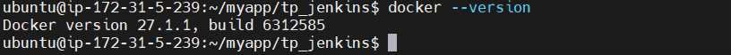
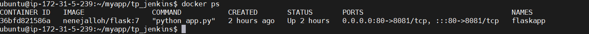
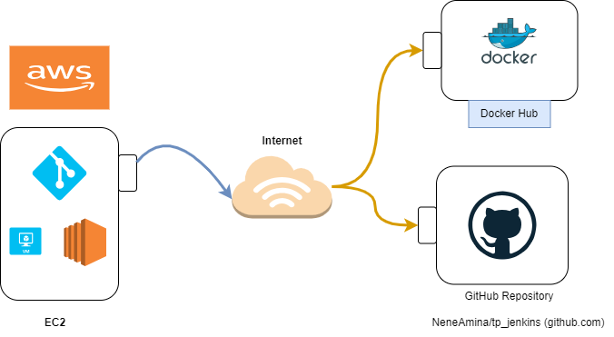

# Nene Aminatou Diallo
# Rimey Aboky

# Docker jenkins
## 1. Architecture mise en place repertoire github

## 1.1 Mise en place du repertoire de travail
Nous allons migrer le repertoire de test vers un repertoire dont nous avons le contraire.
nous clone le repertoire de test
```bash
git clone https://github.com/karimsahebettabaa/jenkins-docker
```
Ensuite nous pointons l'url du repo de test vers le nouveau repo que nous avons créé [repertoire de travail](https://github.com/NeneAmina/tp_jenkins).
```bash
git remote set-url origin https://github.com/NeneAmina/tp_jenkins
```
Maintenant que le repertoire de travail pointe sur notre propre repo github, nous passons à l'installation docker
### 1.2 Installation docker
Nous effectuons l'installation en suivant la documentation officielle sur le site officiel [docker installation](https://docs.docker.com/engine/install/ubuntu/)


### 1.3 Conteniriser l'applicaition
A partir du dockerfile, nous créons une image du container que nous allons deployé.
```bash
docker build -t myapp/flask . 
```
Ensuite nous demarrons le conteneur 

```bash
docker run -d -p 80:8081 myapp/flask

```


l'application tourne sur le port 80 accessible sur http://ec2-63-32-89-123.eu-west-1.compute.amazonaws.com/ disponible sur aws


maintenant que l'application tourne sur un conteneur, nous allons créér un registre de gestion d'image sur docker hub en suivant la documentaition officiel https://hub.docker.com/ 

## 2 Architecture du setup avec docker hub


Maintenant que nous avons notre repertoire github en place et notre registre d'image sur docker hub nous allons mettre à jour notre fichier de build [jenkinsfile](Jenkinsfile).
Nous remplaçons dans le fichier la variable  {REGISTER_DOCKER_HUB} par le nom de registre docker hub.

```bash
pipeline {
    agent any 
   
    stages { 

        stage('Build docker image') {
            steps {  
                sh 'docker build -t nenejalloh/flask:$BUILD_NUMBER .'
            }
        }

        stage('Login to DockerHub') {
            steps {
                sh 'echo $DOCKERHUB_CREDENTIALS_PSW | docker login -u $DOCKERHUB_CREDENTIALS_USR --password-stdin'
            }
        }
         stage('Scan Docker Image') {
            steps {
                script {
                    try {
                        def trivyOutput = sh(script: "trivy image --severity HIGH,CRITICAL nenejalloh/flask:$BUILD_NUMBER", returnStdout: true).trim()
                        println trivyOutput
                        if (trivyOutput.contains("Total: 0")) {
                            echo "No high or critical vulnerabilities found in the Docker image."
                        } else {
                            echo "High or critical vulnerabilities found in the Docker image."
                            // Uncomment the next line to fail the build if vulnerabilities are found
                            // error "Vulnerabilities found in the Docker image."
                        }
                    } catch (Exception e) {
                        error "Error scanning Docker image: ${e.message}"
                    }
                }
            }
        }

        stage('Push image') {
            steps {
                sh 'docker push nenejalloh/flask:$BUILD_NUMBER'
            }
        }
    }

    post {
        always {
            sh 'docker rmi nenejalloh/flask:$BUILD_NUMBER || true'
            sh 'docker logout'
        }
    }
}


```

### 3 Architecture avec jenkins integré 


#### 3.1 Configuration jenkins

Ensuite nous l'execution du pipeline après avoir configuré les variables d'environnement dans notre système jenkins.
#### 3.2 Différents étapes du build 


#### 3.4 Résultat build output 


#### 3.5 Vérification sur dockerhub


#### 3.6 Mis à jour de l'application
```bash
 docker run --name flaskapp -d -p 80:8081 nenejalloh/flask:7
 ```
### 4 Security

#### 4.1 Trivy integration 
A propos de Trivy https://aquasecurity.github.io/trivy/v0.18.3/


### 4 Amelioration
Pour faciliter le déploiement aujourd'hui github dispose directement d'une solution de CI/CD nommé github actions avec laquel nous avons pas à installer et configurer un système intermédiare comme jenkins.L'avantage est que nous avons un système de moins à gérer et pas de plugin spécifique à recherche.
Lien vers github actions https://docs.github.com/fr/actions

## ANNEXE

## Terraform TP2

```bash
provider "aws" {
  region  = "eu-west-1"
  profile = "myTeraaformProfile"
}

resource "aws_s3_bucket" "myBucket" { 
  bucket = "my-tf-bucket001" 
  tags = { 
    Name        = "My bucket" 
    Environment = "Dev" 
  } 
}

resource "aws_s3_bucket_ownership_controls" "ownerwhip" {
  bucket = aws_s3_bucket.myBucket.id
  rule {
    object_ownership = "BucketOwnerPreferred"
  }
}

resource "aws_s3_bucket_public_access_block" "acl" {
  bucket = aws_s3_bucket.myBucket.id

  block_public_acls       = true
  block_public_policy     = true
  ignore_public_acls      = true
  restrict_public_buckets = true
}
// Upload file 
resource "aws_s3_object" "myFirstObject" { 
bucket = "${aws_s3_bucket.myBucket.id}" 
key    = "myTestFile.txt" 
source = "testFiles/testFile.txt" 
etag = "${md5(file("testFiles/testFile.txt"))}" 
} 
// Key pair 
resource "aws_key_pair" "myKeyPair" { 
key_name   = "deployer-key" 
public_key = "ssh-rsa AAAAB3NzaC1yc2EAAAADAQABAAACAQC+PvQFW/LX6vTsK7H/0eCZET6tHk6LyTzPydExyBTf+gkdY4YUh12Mrld9Vt1hPa24NIOZG0uWegPdCc8UAL2ZiRf7FcyyysGEU+7GDk1F+o1xoDoAXO2sMR9MxWxyTfyOaU+Wf/dYgww3rI9IJXYZCjthZlGtOtfNlWumxEA+OaPjZHpmd5g2izBS7Mtxf4zpkuvexjHyXOX+z0EIzttTmPuqklKYgT50J9Qgzoz9wjZ6vw22ys/gXt0xR7cLSx+z8ouwi9FBSO0JOV19Zsl/ze+ZrBZo1RtpVB0q/2yehogHL4RcYZOO4V4O1HlJUXEz5lna/Kue++LsdsoS9nLc2r7hCOyjy1HMsR0JW0MWg6IKtdt5Y8HNXvY3FDVpMaD9DsPoEUr7QAxbSAOFe6aA9uFKdC5TCxS2lEMFDFUMKboJBn+yc4sE0yVYlGff0JgTT0VRAs7SAdHMvnefuprRknUOslHlF+9nP31BhD8UzK3i4HiHcNwfVhwbfu1B/5zJCDHKalebh3o9yw1VsqjNLl3HDMaZGNI/CfeEFBwBzvbtGUPhkQBLah4aJB+UGugLLmXaWdmI8JChwMZfH/OjXpIYAIhaWSkrVMSGAFevsiY3CNZ+qITC+qet9/cSjhni2i/fiWrB5hwGLR2SUeoz8wQ+IDaJGB4vpHWEkMYaiw== nene@nene-VirtualBox"
} 
 
// Variable 
variable "vpc" { 
    type = string 
    default = "vpc-0f80f3beffa31b314" 
} 
 
// Security group 
resource "aws_security_group" "terraformEc2SG" { 
  name        = "terraformEc2SG" 
  description = "Terraform security Group for Ec2" 
  vpc_id      = "${var.vpc}" 
 
  ingress { 
    description      = "SSH from VPC" 
    from_port        = 22 
    to_port          = 22 
    protocol         = "tcp" 
    cidr_blocks      = ["0.0.0.0/0"] 
  } 
 
  egress { 
    from_port        = 22 
    to_port          = 22 
    protocol         = "tcp" 
    cidr_blocks      = ["0.0.0.0/0"] 
  } 
 
  tags = { 
    Name = "SSH from VPC" 
  } 
} 
 
// Variable AMI  
variable "amiId" { 
    type = string 
    default = "ami-0932dacac40965a65" 
} 
 
// Ec2 
resource "aws_instance" "terraformEc2Instance" { 
  ami           = "${var.amiId}" 
  instance_type = "t2.micro" 
  key_name = "deployer-key" 

vpc_security_group_ids = ["${aws_security_group.terraformEc2SG.id}"] 
tags = { 
Name = "terraformEc2Instance" 
} 
} 
 
 ```


